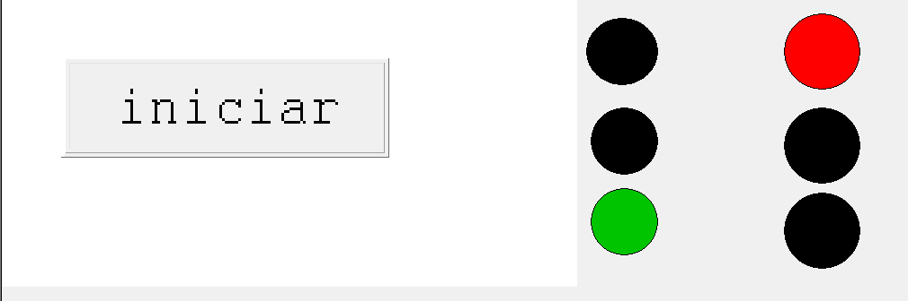

# Sistema de Semáforos

Documentação técnica do projeto de controle de cruzamento semafórico implementado no software **MasterTool IEC** (plataforma **CoDeSys v2.3** da Altus), programado em linguagem **Ladder Diagram (LD - IEC 61131-3)** e destinado à simulação e teste no kit didático **Training Box DUO TB131** (controlador programável **Altus Duo DU350 / DU351**).

---

## 1. Título e Objetivo

- **Atividade:** Sistema de Semáforos (Cruzamento Semafórico de Duas Vias)
- **Controlador Alvo:** CLP Altus Duo DU350 / DU351 (Kit Didático Training Box DUO TB131)
- **Ambiente de Programação:** MasterTool IEC (CoDeSys v2.3)
- **Linguagem IEC 61131-3:** Diagrama Ladder (LD — _Ladder Diagram_)

### Objetivo Geral

Implementar, modelar formalmente e validar através de simulação e Interface Homem-Máquina (IHM) a lógica de controle sequencial para um cruzamento urbano de duas vias perpendiculares (**Rua A** e **Rua B**), garantindo tempos de fluxo, atenção e segurança absoluta contra estados conflitantes (como colisões por abertura simultânea de ambas as vias).

## 2. Descrição do Problema

O cruzamento rodoviário é composto por dois semáforos tricolores completos:

- **Semáforo da Rua A:** Lâmpadas Vermelha (`A_VERMELHO`), Amarela (`A_AMARELO`) e Verde (`A_VERDE`).
- **Semáforo da Rua B:** Lâmpadas Vermelha (`B_VERMELHO`), Amarela (`B_AMARELO`) e Verde (`B_VERDE`).

---

## 3. Modelagem Formal (Autômato Finito Determinístico - AFD)

Para assegurar a consistência lógica, a ausência de estados indefinidos e a garantia de intertravamento de segurança, o sistema foi formalmente modelado como um **Autômato Finito Determinístico (AFD)**.

### Definição da Quíntupla Formal

O autômato é formalmente definido pela quíntupla:

$$M = (Q, \Sigma, \delta, q_0, F)$$

Onde:

1. **Conjunto de Estados ($Q$):** Representa as fases operacionais mutuamente exclusivas do cruzamento:
   $$Q = \{S_0, S_1, S_2, S_3\}$$
    - $S_0$ (Fase 1): Rua A Verde, Rua B Vermelho (Dispara temporizador $T_1$ de 5s).
    - $S_1$ (Fase 2): Rua A Amarelo, Rua B Vermelho (Dispara temporizador $T_2$ de 2s).
    - $S_2$ (Fase 3): Rua A Vermelho, Rua B Verde (Dispara temporizador $T_3$ de 5s).
    - $S_3$ (Fase 4): Rua A Vermelho, Rua B Amarelo (Dispara temporizador $T_4$ de 2s).

2. **Alfabeto de Entrada ($\Sigma$):** Sinais binários oriundos das saídas $Q$ dos quatro blocos temporizadores On-Delay (`TON`):
   $$\Sigma = \{t_{1q}=0, t_{1q}=1, t_{2q}=0, t_{2q}=1, t_{3q}=0, t_{3q}=1, t_{4q}=0, t_{4q}=1\}$$

3. **Estado Inicial ($q_0$):**
   $$q_0 = S_0$$
   _(Ativado pelo pulso da borda de subida do botão de partida)_.

4. **Conjunto de Estados Finais ($F$):**
   $$F = \emptyset$$
   Como o controle de semáforo é um processo industrial cíclico e contínuo executado ininterruptamente no CLP, não existe estado de terminação/aceitação.

5. **Função de Transição ($\delta$):**
    - $\delta(S_0, t_{1q}=0) = S_0$ _(permanência enquanto temporizador não expira)_
    - $\delta(S_0, t_{1q}=1) = S_1$ _(avanço para amarelo da Rua A após 5s)_
    - $\delta(S_1, t_{2q}=0) = S_1$ _(permanência)_
    - $\delta(S_1, t_{2q}=1) = S_2$ _(avanço para verde da Rua B após 2s)_
    - $\delta(S_2, t_{3q}=0) = S_2$ _(permanência)_
    - $\delta(S_2, t_{3q}=1) = S_3$ _(avanço para amarelo da Rua B após 5s)_
    - $\delta(S_3, t_{4q}=0) = S_3$ _(permanência)_
    - $\delta(S_3, t_{4q}=1) = S_0$ _(retorno ao estado inicial após 2s)_

### Diagrama de Transição de Estados

_Figura 1: Diagrama de transição de estados do AFD._

### Tabela de Relação: Estados, Saídas e Temporizações Reais

| Estado | Flag Interna |          Rua A          |          Rua B          | Temporizador Disparado | Tempo Programado (PT) | Próximo Estado |
| :----: | :----------: | :---------------------: | :---------------------: | :--------------------: | :-------------------: | :------------: |
| **S0** |   `%MX0.0`   |  **VERDE** (`%QX1.2`)   | **VERMELHO** (`%QX1.3`) |      `T1` (`TON`)      |  `T#5s` (5 segundos)  |     $S_1$      |
| **S1** |   `%MX0.1`   | **AMARELO** (`%QX1.1`)  | **VERMELHO** (`%QX1.3`) |      `T2` (`TON`)      |  `T#2s` (2 segundos)  |     $S_2$      |
| **S2** |   `%MX0.2`   | **VERMELHO** (`%QX1.0`) |  **VERDE** (`%QX1.5`)   |      `T3` (`TON`)      |  `T#5s` (5 segundos)  |     $S_3$      |
| **S3** |   `%MX0.3`   | **VERMELHO** (`%QX1.0`) | **AMARELO** (`%QX1.4`)  |      `T4` (`TON`)      |  `T#2s` (2 segundos)  |     $S_0$      |

## 5. Tabela de Variáveis e Endereçamento

Todas as variáveis do projeto foram extraídas diretamente do código-fonte real ([`PLC_PRG.EXP`](file:///F:/Codesys/automação-industrial/3-sistema_semaforo/codesys_ext/PLC_PRG.EXP)) e conferidas com as declarações de hardware do arquivo [`CONFIGURAÇÃO DO CP.EXP`](file:///F:/Codesys/automação-industrial/3-sistema_semaforo/codesys_ext/CONFIGURAÇÃO%20DO%20CP.EXP):

| Nome da Variável | Tipo de Dado | Endereço Físico / IEC | Categoria       | Escopo            | Descrição Operacional                                    |
| :--------------- | :----------- | :-------------------- | :-------------- | :---------------- | :------------------------------------------------------- |
| `botao`          | `BOOL`       | `%IX0.0`              | Entrada Digital | Local (`PLC_PRG`) | Botão de partida / início do ciclo semafórico            |
| `A_VERMELHO`     | `BOOL`       | `%QX1.0`              | Saída Digital   | Local (`PLC_PRG`) | Lâmpada Vermelha do Semáforo da Rua A                    |
| `A_AMARELO`      | `BOOL`       | `%QX1.1`              | Saída Digital   | Local (`PLC_PRG`) | Lâmpada Amarela do Semáforo da Rua A                     |
| `A_VERDE`        | `BOOL`       | `%QX1.2`              | Saída Digital   | Local (`PLC_PRG`) | Lâmpada Verde do Semáforo da Rua A                       |
| `B_VERMELHO`     | `BOOL`       | `%QX1.3`              | Saída Digital   | Local (`PLC_PRG`) | Lâmpada Vermelha do Semáforo da Rua B                    |
| `B_AMARELO`      | `BOOL`       | `%QX1.4`              | Saída Digital   | Local (`PLC_PRG`) | Lâmpada Amarela do Semáforo da Rua B                     |
| `B_VERDE`        | `BOOL`       | `%QX1.5`              | Saída Digital   | Local (`PLC_PRG`) | Lâmpada Verde do Semáforo da Rua B                       |
| `S0`             | `BOOL`       | `%MX0.0`              | Memória Interna | Local (`PLC_PRG`) | Bit de estado $S_0$: Rua A Verde / Rua B Vermelho        |
| `S1`             | `BOOL`       | `%MX0.1`              | Memória Interna | Local (`PLC_PRG`) | Bit de estado $S_1$: Rua A Amarelo / Rua B Vermelho      |
| `S2`             | `BOOL`       | `%MX0.2`              | Memória Interna | Local (`PLC_PRG`) | Bit de estado $S_2$: Rua A Vermelho / Rua B Verde        |
| `S3`             | `BOOL`       | `%MX0.3`              | Memória Interna | Local (`PLC_PRG`) | Bit de estado $S_3$: Rua A Vermelho / Rua B Amarelo      |
| `botao_pulso`    | `R_TRIG`     | —                     | Bloco Funcional | Local (`PLC_PRG`) | Detector de borda de subida para o sinal de partida      |
| `T1`             | `TON`        | —                     | Bloco Funcional | Local (`PLC_PRG`) | Temporizador On-Delay do Estado $S_0$ ($PT = 5\text{s}$) |
| `T2`             | `TON`        | —                     | Bloco Funcional | Local (`PLC_PRG`) | Temporizador On-Delay do Estado $S_1$ ($PT = 2\text{s}$) |
| `T3`             | `TON`        | —                     | Bloco Funcional | Local (`PLC_PRG`) | Temporizador On-Delay do Estado $S_2$ ($PT = 5\text{s}$) |
| `T4`             | `TON`        | —                     | Bloco Funcional | Local (`PLC_PRG`) | Temporizador On-Delay do Estado $S_3$ ($PT = 2\text{s}$) |

---

## 6. Interface Homem-Máquina (IHM)

A tela de visualização gráfica foi criada no recurso integrado de IHM do MasterTool IEC. Quando desenergizadas, as lâmpadas permanecem na cor preta/apagada (RGB `0`):

_Figura 1: Tela de IHM (`VISUALIZACAO1`) em modo de execução, ilustrando o estado inicial S0 (Rua A: Verde aceso / Rua B: Vermelho aceso) e o botão Iniciar._

## 9. Código Ladder

_Figura 3: Código Ladder no MasterTool IEC exibindo as Networks 0001 a 0008, com o bloco `R_TRIG` de partida, bobinas `SET/RESET` dos estados e acionamento das saídas digitais._

---
